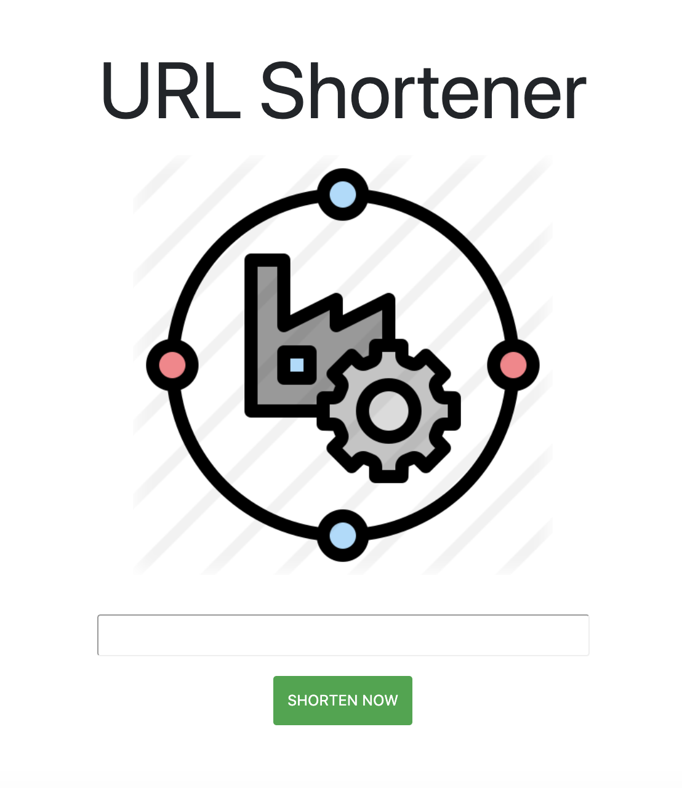

# URL Shortener

喜歡瀏覽的網站網址長的亂七八糟嗎？一個簡單的app，將網址轉成簡易短網址



## 安裝

- 開啟終端機，輸入
```
git clone https://github.com/marcho001/URL-Shortener-exam.git
```
- 進入資料夾安裝套件
```
npm install
```
- 執行程式
```
npm run dev
```

## 功能
- 輸入一個網址，將會回傳一個較短的網址替代
- 點選縮短的網址前往該網站
- 可以點選copy 複製網址，讓你能在任何地方貼上


## 工具
- Node.js
- Express
- Express-handlebars
- Bootstrap
- body-parser
- Mongodb
- Mongoose
- clipboard.js
- animate.js